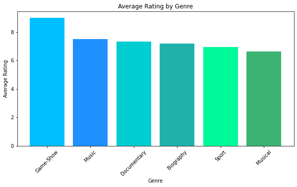
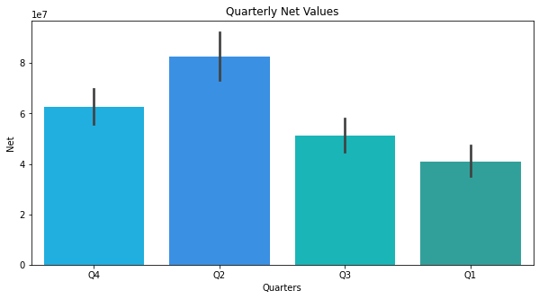
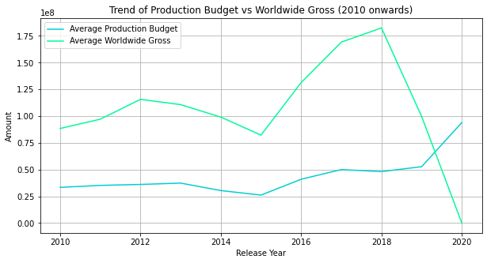
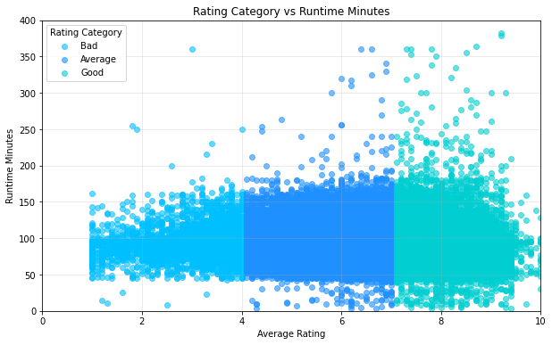
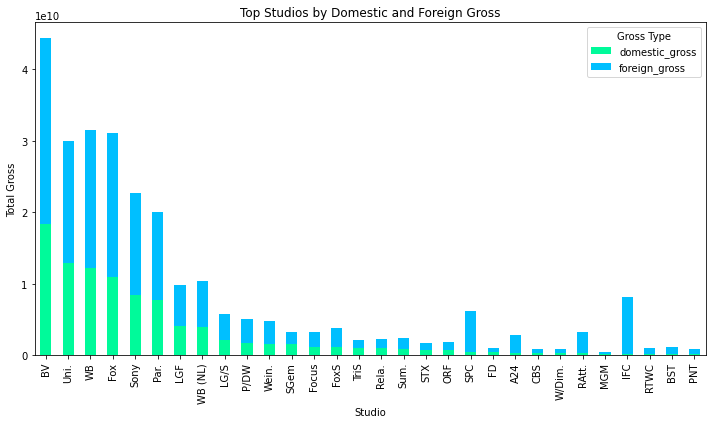

# **FILM INDUSTRY ANALYSIS**

Author: ***GROUP TWO*** 
         
         MEMBERS:
         
         1. William Nyawir
         2. Angela Wachira
         3. Kelvin Mburu
         4. Maurine Chemutai
         5. Marcus Kaula

**MOVIES DATA**

***Tableau link***: https://public.tableau.com/views/Group_Two_Phase_Two_Project_Story/Story1?:language=en-US&:sid=&:redirect=auth&:display_count=n&:origin=viz_share_link

**OVERVIEW**

The entertainment industry has increasingly shifted toward original video content. Established companies are investing heavily in film production to capture audience attention, diversify income streams and remain competitive in a rapidly evolving media landscape. Recognizing this trend the company plans to launch a new movie studio but lacks proir experience in film production and distribution.

Because movie production requires large upfront investments and carries high uncertainity, relying on intuition alone would expose the company to significant financial risk. A data-driven approach is therefore essential to understand what type of films perform well in the cuurrent market and to reduce the likeliood of costly failures.

**PROBLEM STATEMENT**

Key challenges faced by decision-makers include:

- To identify top genres with best rates.
- To understand release window of the movies and what quarter of the year has highest ratings and revenue.
- To understand the general trend of the movie industry over the years.
- To understand the relationship between production budget and the return on investment.
- To understand which season has the highest movie releases.
- To understand if there is a relationship between movie run-time and the ratings, and the general run-time of most movies.
- To see whether movies earn more revenue domestically or internationally.
- To identify top performing production studios in terms of revenue.

This project seeks to answer the following questions:

"Which film genres have consistently performed well at the box office?"
"How does production budget relate to financial success?"
"Are there specific trends or patterns in film performance over time?"
"What genres are associated with high ratings?"

Addressing this problem will enable business leaders to make evidence based film production decisions, reduce exposure to risks, and establish a strong foundation for successful entry into the film industry.

**ANALYSIS**

***Observations***
1. Game- show has the highest average rating

***Observations***
1. Second quater of the year averages the highest net profit with more than 80,000,000M
2. First quater has the lowest net profit with an average of less that 40,000,000M

***Observations***
1. 2018 had the highest gross profit
2. 2020 had the lowest gross profit

.png)

***Observations***
1. Fourth month of the year has the least movies released
2. First and last month of the year has the highest movies released

***Observation***
1. The scatter plot shows that most of the movies have runtime minutes of between 80 and 100.

***Observations***
1. BV averages the highest gross total of the studios

**CONCLUSIONS**

The release month with the highest worldwide gross and the highest revenue, is May. The movie market in terms of trend is a fluctuating market depending on the present market condition, eg season (booming), pandemic (decline). There is a positive relationship between production budget and worldwide gross, still considering the present market condition when making production investment decisions. As the initial investment increases, the potential for higher global returns generally rises, though the density of the data at lower budget levels suggests that significant financial success is still possible for smaller productions. December, a festive season, has the highest number of released movies. Second quarter of the year, Q2 (April-June) is the most profitable period for the company, with April having the highest rating, despite a low number of movie releases. The best performing genre is Gameshow with a rating of 9.0. The run-time of most movies is between 80 and 100 minutes. The best performing market is the international market. The best performing production studio, with the highest revenue is BV.

**RECOMMENDATIONS**

1. Prioritize Q2 as the best release window The best period to produce movies is the second quarter of the year. This season has the highest average ratings, and during this season, there is a higher return on investments. This season is not saturated hence movie released will be easily noticed and viewed.

2. Prioritize Genres with high ratings Gameshow is the top rated genre, followed by Music genre, then Documentary genre, then Biography, then Sport. the ratings are 9.0, 7.5,7.3, 7.1 and 6.9 respectively. These should be considered as the top 5 genres to be produced by the company.

3. Prioritize Genres with constant Trend Instead of only checking the ratings, trend is also a very important factor to consider. Genres like Action, Adventure, Drama and crime have a constant trend in the market and still have high ratings above 6. Drama has also proved to be the most popular genre in terms of movies and should also be considered.

4. Prioritize producing movies with a duration between 80 and 100 minutes the analysis shows that movie runtime does affect the movie rating but not as much. The relationship is weak. However, it is preferable to have a movie runtime of between 80 and 100 minutes. This range proves significant since the mean of runtime minutes is 95 and this falls in the range(80-100).

5. Prioritize International markets From the analysis, we can see that the foreign gross often exceeds the domestic gross. Both markets have outliers, but the international market has a high baseline of success in films compared to the domestic market.

6. Prioritize best performing production studios From the analysis, BV studio has the highest total gross followed by WB, Fox then Uni. Which means that they are the top performing studios in terms of production and should be considered.